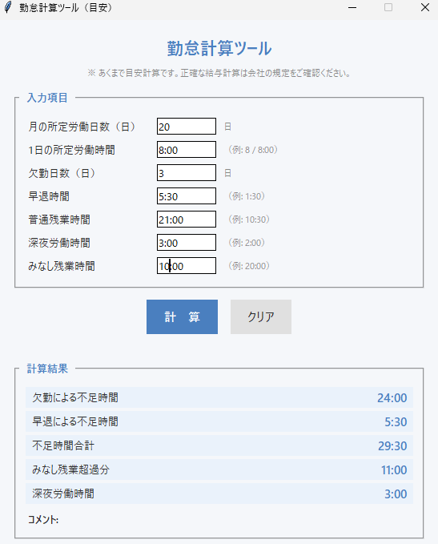

# 勤怠計算ツール

Python + Tkinter で作成した、勤怠時間の目安を計算するデスクトップGUIアプリです。

> **注意**: このツールは勤怠時間の**目安計算**を目的としています。  
> 法律上の正確な給与計算には対応していません。正確な計算は会社の規定・労務担当者にご確認ください。

---

## スクリーンショット



---

## ツール概要

月ごとの勤怠データ（欠勤・早退・残業・深夜労働など）を入力フォームに入力して「計算」ボタンを押すだけで、勤怠時間の目安を瞬時に確認できます。  
外部APIや有料サービスは一切使用せず、ローカル環境のみで動作します。

---

## 作成目的

SES（システムエンジニアリングサービス）での勤務経験から生まれたツールです。

固定残業制（みなし残業）を採用する職場では、残業時間がみなしの範囲を超えているかどうかを自分で正確に把握しにくい場面がありました。また、欠勤・早退が重なった月に「今月は何時間不足しているか」を手早く確認する手段がなく、確認のたびに手計算が必要でした。

こうした実務上の課題を解決するために開発したのが本ツールです。外部APIや有料サービスに一切依存せず、ローカル環境のみで即座に動作するシンプルな設計を重視しています。

---

## 想定利用シーン

- 月末に勤怠を締める前の自己確認
- 固定残業制（みなし残業）で超過分があるか確認したいとき
- 欠勤・早退による不足時間を把握したいとき

---

## 機能一覧

| 機能 | 説明 |
|------|------|
| 欠勤による不足時間の計算 | 欠勤日数 × 1日所定時間 |
| 早退による不足時間の計算 | 入力した早退時間をそのまま集計 |
| 不足時間合計 | 欠勤＋早退の合計 |
| みなし残業超過分の計算 | 残業時間 − みなし残業時間（マイナスは0扱い） |
| 深夜労働時間の表示 | 入力値をそのまま表示 |
| 簡易コメント | 勤怠状況に応じたコメントを自動生成 |
| エラー表示 | 不正な入力値を検知してメッセージ表示 |
| クリア機能 | 入力・結果をデフォルト値にリセット |

---

## 使い方

### 前提条件

- Python 3.10 以上（Tkinter は Python 標準同梱）

開発環境:
- Python 3.12
- Windows 11

### インストール

```bash
git clone https://github.com/kyo-primary/portfolio-1.git
cd portfolio-1
```

追加パッケージは不要です（標準ライブラリのみ）。

### 起動

```bash
python main.py
```

### テスト実行

```bash
pip install pytest
pytest tests/
```

---

## 画面イメージ

```
┌─────────────────────────────────┐
│       勤怠計算ツール             │
│ ※ あくまで目安計算です          │
│                                  │
│ ┌─ 入力項目 ──────────────────┐ │
│ │ 月の所定労働日数   [  20  ] 日│ │
│ │ 1日の所定労働時間  [ 8:00 ]   │ │
│ │ 欠勤日数           [   0  ] 日│ │
│ │ 早退時間           [ 0:00 ]   │ │
│ │ 普通残業時間       [ 0:00 ]   │ │
│ │ 深夜労働時間       [ 0:00 ]   │ │
│ │ みなし残業時間     [ 0:00 ]   │ │
│ └──────────────────────────────┘ │
│    [  計  算  ]  [  クリア  ]    │
│                                  │
│ ┌─ 計算結果 ──────────────────┐ │
│ │ 欠勤による不足時間     8:00  │ │
│ │ 早退による不足時間     0:00  │ │
│ │ 不足時間合計           8:00  │ │
│ │ みなし残業超過分       5:00  │ │
│ │ 深夜労働時間           2:00  │ │
│ │ コメント: 不足時間が...      │ │
│ └──────────────────────────────┘ │
└─────────────────────────────────┘
```

---

## 入力項目

| 項目 | 説明 | 入力例 |
|------|------|--------|
| 月の所定労働日数 | その月に出勤すべき日数 | `20` |
| 1日の所定労働時間 | 1日あたりの所定時間 | `8` / `8:00` / `7:30` |
| 欠勤日数 | 無給欠勤した日数 | `1` / `0.5` |
| 早退時間 | 月合計の早退時間 | `1:30` |
| 普通残業時間 | 月合計の残業時間 | `15:00` / `26:30` |
| 深夜労働時間 | 22:00〜5:00相当の月合計 | `2:00` |
| みなし残業時間 | 固定残業制の設定時間 | `20:00` |

**時間入力フォーマット**:
- `2` → 2時間0分
- `2:30` → 2時間30分
- `26:00` → 26時間0分（翌日にまたがる集計など）

---

## 出力例

**入力**: 所定20日・8h/日、欠勤1日、早退2h、残業15h、深夜3h、みなし10h

```
欠勤による不足時間     8:00
早退による不足時間     2:00
不足時間合計          10:00
みなし残業超過分        5:00
深夜労働時間           3:00

コメント:
不足時間が10:00あります。勤怠状況を確認してください。
みなし残業を5:00超過しています。
深夜労働が3:00あります。
```

---

## ファイル構成

```
portfolio-1/
├── main.py                          # 起動エントリポイント
├── attendance_calculator.py         # 計算ロジック（関数・データクラス）
├── attendance_gui.py                # Tkinter GUI処理
├── README.md
├── docs/
│   └── screenshot.png               # アプリ画面スクリーンショット
└── tests/
    ├── __init__.py
    └── test_attendance_calculator.py  # pytestテスト
```

---

## 技術スタック

| カテゴリ | 技術 |
|----------|------|
| 言語 | Python 3.12 |
| GUI | Tkinter（標準ライブラリ） |
| テスト | pytest |
| バージョン管理 | Git / GitHub |

---

## 開発工程

| フェーズ | 内容 |
|----------|------|
| 要件定義 | 勤怠計算に必要な項目・計算ルールの整理 |
| 設計 | データクラス・関数の責任分離、GUI設計 |
| 実装 | 計算ロジック → GUI の順で実装 |
| テスト | pytest による単体テスト（計算ロジック） |

---

## 学習ポイント

- **責任分離の実践**: 計算ロジック（`attendance_calculator.py`）とUI（`attendance_gui.py`）を明確に分離し、テスト可能な設計を意識した
- **Tkinter レイアウト**: `pack` マネージャーを使ったウィンドウ構成、`StringVar` によるデータバインディング
- **カスタム例外**: `InvalidTimeError` を定義することで、エラーハンドリングの意図を明示的に表現した
- **dataclass の活用**: 入力・出力データを `@dataclass` で型安全に管理
- **pytest によるテスト**: 計算ロジックに対する単体テストを作成し、リグレッションを防ぐ仕組みを構築した

---

## バージョン

**Current Version: v1.0.0**

### リリース内容

- 勤怠計算GUI実装（Tkinter）
- 欠勤・早退による不足時間計算
- みなし残業超過分の計算
- 深夜労働時間の表示
- 勤怠状況に応じたコメント自動生成
- pytest による単体テスト作成（41件）

---

## 注意事項

- 計算はあくまで**目安**です。割増賃金率・控除金額への換算は含みません。
- 深夜労働の時間帯（一般的に22:00〜翌5:00）の判定は行っていません。ユーザーが集計した時間を入力してください。
- みなし残業（固定残業）の適用有無は会社の契約内容によって異なります。
- 日本の労働基準法に基づいた給与計算が必要な場合は、社労士や会社の労務担当者にご相談ください。

---

## 今後の改善案

- [ ] 月次レポートのCSV出力
- [ ] 入力データの保存・読み込み（JSON）
- [ ] 複数月の推移グラフ表示
- [ ] 割増賃金率を設定して概算額を表示
- [ ] ダークモード対応
- [ ] 設定ファイルで所定労働日数・みなし残業時間を保存

---

## このプロジェクトで学んだこと

- **要件定義**: 実務課題を整理し、必要な計算ロジックと画面項目を自ら定義した
- **GUI設計**: Tkinter の `pack` レイアウトと `StringVar` によるデータバインディングを習得した
- **Python実装**: `@dataclass` による型安全な設計と、責任分離を意識したモジュール構成を実践した
- **テストコード作成**: pytest で41件の単体テストを作成し、リグレッション防止の仕組みを構築した
- **エラーハンドリング**: カスタム例外 `InvalidTimeError` を定義し、ユーザーに分かりやすいメッセージを表示する設計を実践した
- **GitHub運用**: コミット管理・README整備・スクリーンショット配置など、公開レベルのリポジトリ管理を経験した
